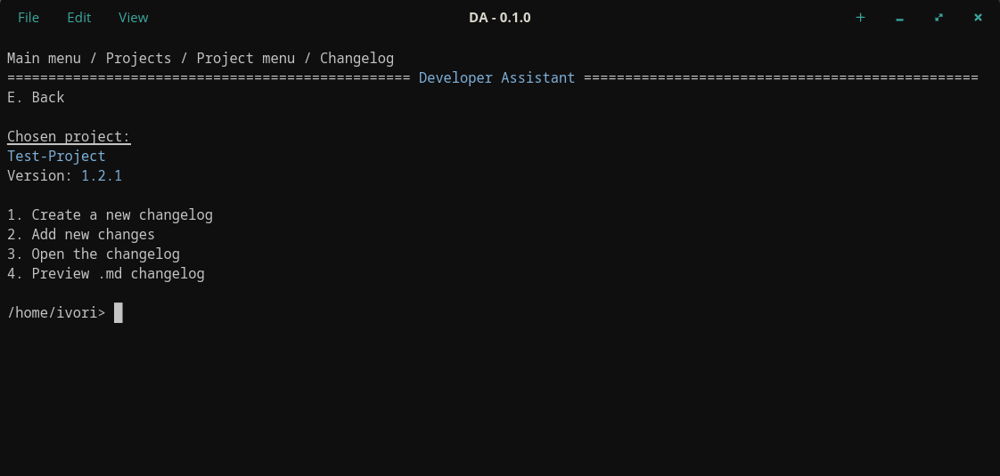

# Developer Assistant

> **New here?** Start with [SETUP.md](./SETUP.md) to get started.

> **CHANGELOG** Yes, I keep a [CHANGELOG](./CHANGELOG.md)

**Requirements:** Python 3.13 or later.

**Cross-platform:** Windows, Linux, macOS(unverified)

**Dependencies:** Listed in [pyproject.toml](./pyproject.toml)

## Appearance

### Coloured, easy-to-use menus

### Beautiful changelog previews
Preview your Markdown changelogs directly in the terminal with Rich rendering:

## Introduction

### What does this tool do?
Developer Assistant is a lightweight TUI tool for automating and managing your changelogs. You can customize the templates to match your existing format, and use DA as a central hub to access every changelog and project folder you maintain.

You can manage as many projects as you like. Each project gets its own `.ini` file, created automatically through the menu based on the information you provide. These act as links that tell DA where your changelogs are and what's the last version number.

Your files are kept safe at all times. Before adding new changes, your existing `CHANGELOG.md` is automatically backed up. While editing, all changes are written to a temporary file first and only applied to the real changelog once you confirm them.

### Using the program.
1. **What *not* to do**

Don't change the folder structure or modify variable names inside `.ini` files.

2. **Features and information**

**The user's data (`Templates/`, `Projects/`, `memory.ini`) is stored in standard locations:**
Windows: `C:\Users\...\AppData\Roaming\da-ui\`
Linux: `~/.config/da-ui/`
macOS: `~/Library/Application Support/da-ui/`

The `da-ui/` folder will be created automatically.
You can access its content quickly when going to: `Main menu / Settings`

- *Customizable templates*

Explore the **local** `Templates/` folder and modify the template contents to your liking - **just avoid changing the `{{placeholder}}` names**.

- *Linked projects all in one place*

The `Projects/` folder holds the `.ini` files you create when starting a new project with DA. 

- *Safe changelog updates*

Before applying any changes, your previous `CHANGELOG.md` is automatically backed up into your project folder. 
New changes are first written to a temporary file and only applied to the real changelog after you confirm them.
This ensures your existing changelog is never overwritten or corrupted, and you always have a fallback copy.
If the temporary changelog is present on startup you are prompted to remove or keep it.

- *Ease of navigation*

You can access files/folders and configuration straight from the menus, so you shouldn't find yourself searching through the program's directory or even your local user data very often.

- *Configuration*

The `memory.ini` file does exactly what you'd expect, it features:

> Last project

> Pinned projects

> Custom colour

Last project gets updated automatically, the rest are up to you.

- *`Ctrl+C` works everywhere to quickly exit DA.*

### Documentation.
Documentation includes `SYSTEM STRUCTURE.txt`, example -and default files. If you ever need to replace a file, the example/default files can also be used for that.
`SYSTEM STRUCTURE.txt` - explains what module does what and how the menu flows.
`CHANGELOG.md` - this programs own changelog.

### Setting up your first project
For a dummy changelog to experiment with, navigate to `Main menu / Projects`, choose `Test-Project`, then choose option `4.` to start adjusting this projects paths. 

The `Test-Project/` folder is included in the programs root folder for repo clones and is safe to experiment with. If you installed from an URL just make a `CHANGELOG.md` anywhere and point the `.ini` file to it.

Once configured, you can create as many changelog entries as you want by picking that project in the menu.

## Updating DA
Two possibilities, depending on how you installed.

### 1. Installed directly from GitHub URL
A. **Using uv:**
1. `uv tool install git+https://github.com/Ivory-Hubert/Developer-Assistant`

B. **Using pip:**
1. `pip install --upgrade git+https://github.com/Ivory-Hubert/Developer-Assistant`

### 2. Installed from a local clone
*Run all terminal commands in the repo folder*

A. **Using uv:**
1. `git pull`
2. `uv tool install .`

B. **Using pip:**
1. `git pull`
2. `pip install .`

C. **No install, running from repo root:**
Just `git pull`
