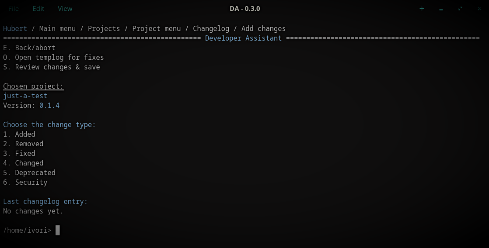
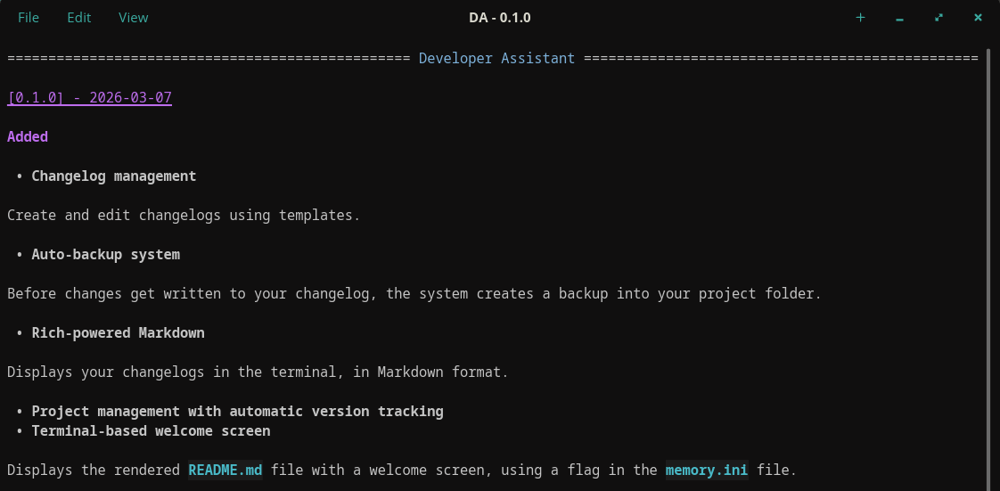

# Developer Assistant
[](https://pypi.org/project/developer-assistant/)

> **A lightweight TUI app for managing and simplifying your Markdown changelogs.**

> `pip install developer-assistant`

* **Installation:** more options in [SETUP](./SETUP.md)

* **Changes:** yes, I keep a [CHANGELOG](./CHANGELOG.md)

---

* **Requirements:** Python 3.10 or later.

* **Cross-platform:** Windows, Linux, macOS(*unverified*)

* **Specifics:** [SYSTEM STRUCTURE](./documents/SYSTEM_STRUCTURE.txt)


## Appearance

### Coloured, easy-to-use menus
A comfortable interface with a modern polish, built the good old way:



### Beautiful changelog previews
Preview your Markdown changelogs directly in the terminal with Rich rendering:




## Introduction

### What does this program do?
Developer Assistant is a lightweight TUI for simplifying and managing your changelogs. You can customize the templates for **each profile** to match your existing format, and use DA as a central hub to access every changelog and project folder you maintain.

You can create as many profiles as you need. Each profile gets its own **project specific** `.ini` files, created automatically through the menu based on the information you provide. These act as links that tell DA where your changelogs are, which profile owns them and what's the last version number.

Each project `.ini` can also hold a custom terminal command, that is run in that projects folder. So you can easly integrate updating your changelogs in DA with Git commands for example.

**Your files are kept safe at all times.** Before adding new changes, your existing `CHANGELOG.md` is automatically backed up. While editing, all changes are written to a temporary file first and only prepended to & replaced with your real changelog once you confirm them.

---

### Using the program.
1. **What *not* to do**

Don't change the folder structure or modify variable names inside `.ini` files.

2. **Features and information**

**The user's data (`Templates/`, `Projects/`, `memory.ini`) is stored in standard locations:**

* Windows: `C:\Users\...\AppData\Roaming\da-ui\`

* Linux: `~/.config/da-ui/`

* macOS: `~/Library/Application Support/da-ui/`

The `da-ui/` folder and subfolders will be created automatically.

> [!TIP] 
> You can access its contents quickly when going to: `Main menu / Settings`

**Profiles for seperate projects and templates**

The program comes with the "Default" profile, you can choose to either stick with this one or create your own profiles in `Main menu / Profiles`. Each profile has seperate projects and they can't be accessed by other profiles. You can choose to customize the templates seperately too.

> [!NOTE]
> Migrating a project or template from one profile to another is currently manual, **make sure to also change the "*owner*" value in `.ini` files accordingly**.

---

**Customizable templates**

In the **local** `Templates/` folder you can modify the template contents to your liking - **just avoid changing the `{{placeholder}}` names**.

Templates come in three flavours:

* changelog_template.txt - *Changelog title*

* header_template.txt - *Version and date*

* entry_template.txt - *Change entry and comments*


**Linked projects all in one place**

The `Projects/` folder holds the `.ini` files you create when starting a new project with DA. 

[Project.ini example](./documents/project-example.ini)

The `command` variable is a custom command that DA will run in your project folder once you choose "Format & commit" in `Main menu / Projects / Project menu / Changelog`. Even if provided, it is **not** run without your confirmation, first it's printed with the folder name and you can choose to skip it.

`owner` & `edited` are filled out automatically when a new project is created and `edited` updates with every changelog update.

---

**Safe changelog updates**

Before applying any changes, your previous `CHANGELOG.md` is automatically backed up into your project folder. 
New changes are first written to a temporary file and only prepended to & replaced with your real changelog once you confirm them.

This ensures your existing changelog is never overwritten or corrupted, and you always have a fallback copy.
If the temporary changelog is present on startup you are prompted to remove or keep it.


**Ease of navigation**

You can access files/folders and configuration straight from the menus, so you shouldn't find yourself searching through the program's directory or even your local user data very often.


**Configuration**

The `memory.ini` file does exactly what you'd expect, it features:

* Last project

* Pinned projects

* Active profile

* Custom colour

Last project & active profile get updated automatically, the rest are up to you.

> [!TIP] 
> **`Ctrl+C` works everywhere to quickly exit DA.**

---

### Setting up the test project
For a dummy changelog to experiment with, navigate to `Main menu / Projects`, choose `test-project`, then choose option `3.` to start adjusting this projects paths. **Before setting up your own profile don't change "*Default*"**

The `test-project/` folder is included in the programs root folder **for repo clones** and is safe to experiment with. If you installed from PyPI just make a `CHANGELOG.md` anywhere and point the `.ini` file to it.

Once configured, you can create as many changelog entries as you want by picking that project in the menu.


## Updating DA
Two possibilities, depending on how you installed.

### 1. Installed from PyPI
A. **Using uv:** 
```bash
uv tool upgrade developer-assistant
```

B. **Using pip:** 
```bash
python -m pip install -U developer-assistant
```

### 2. Installed from a local clone
*Run all terminal commands in the repo folder*

A. **Using uv:**

1. `git pull`
2. `uv tool install .`

B. **Using pip:**

1. `git pull`
2. `pip install .`

C. **No install, running from repo root:**

Just `git pull`
